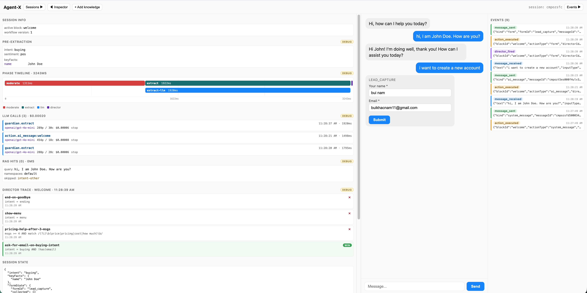

# Agent Inspector



## Stack

NestJS · Vite+React · Postgres+pgvector · Redis/BullMQ · OpenRouter · OpenAI · Firecrawl · Prisma · Vercel AI SDK.


## Quick start

```bash
# 1. infra
docker compose up -d

# 2. env
cp apps/api/.env.example apps/api/.env
# fill OPENROUTER_API_KEY, OPENAI_API_KEY, FIRECRAWL_API_KEY

# 3. deps
npm install

# 4. db
npm run db:migrate

# 5. dev (api on :3000, web on :5173)
npm run dev
```

## Database & queue GUIs

`docker compose up -d` also starts two browser-based admin UIs:

| Tool | URL | Connect with |
|---|---|---|
| **Adminer** (Postgres) | http://localhost:8080 | System `PostgreSQL` · Server `postgres` · User/Pass `postgres` · DB `agentx` |
| **RedisInsight** (Redis) | http://localhost:5540 | Host `redis` · Port `6379` (no auth) — BullMQ keys are under the `bull:` prefix |

Use the **compose service name** (`postgres` / `redis`) as the host, not `localhost` — the GUIs talk to the DBs over the compose network. Dev-only; never expose these ports in a deployed environment.

## Resetting data

Full nuke — drops both docker volumes (Postgres + Redis), then re-create schema:
```bash
docker compose down -v
docker compose up -d
cd apps/api && npx prisma migrate deploy
```

Finer-grained options:

| Goal | Command |
|---|---|
| Reset just Postgres data | `docker compose down && docker volume rm agent-x_postgres_data && docker compose up -d` |
| Reset just Redis (clear BullMQ queues, keep DB) | `docker exec agent-x-redis-1 redis-cli FLUSHALL` |
| Drop + recreate schema only (volumes intact) | `cd apps/api && npx prisma migrate reset` |
| Wipe app rows but keep schema | `docker exec agent-x-postgres-1 psql -U postgres -d agentx -c 'TRUNCATE "Session","KnowledgeSource","WebhookEvent","Memory" CASCADE;'` |

`prisma migrate reset` is usually the friendliest in dev — drops + re-applies all migrations in one shot without touching docker volumes.

